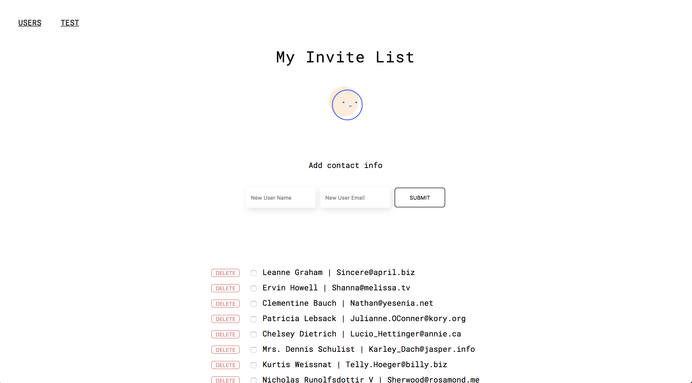
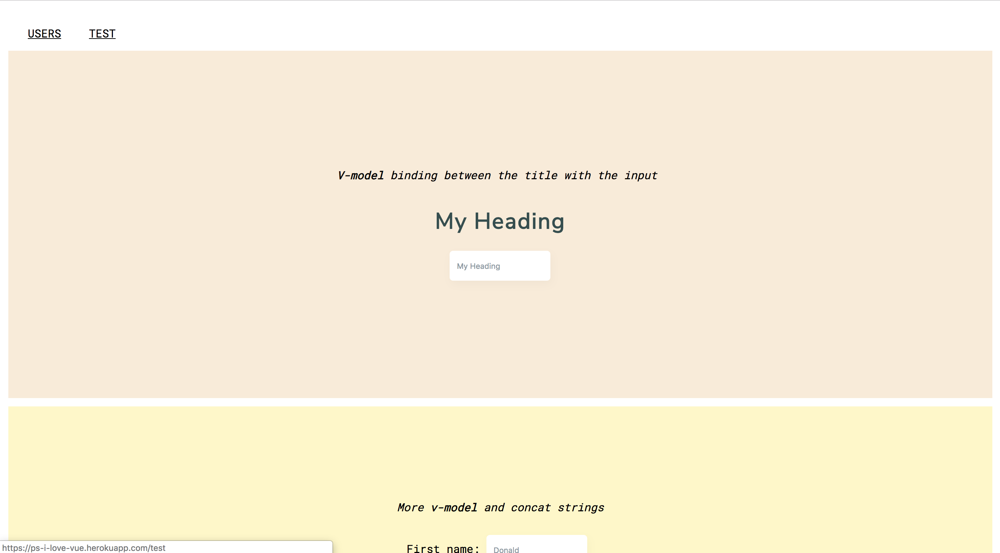

# P.S. I Love Vue

> Just learning vue things

## What is this?

This is my VueJS application, created to learn Vue things. This app is mostly my documentation for the things I've learned (in the /test page) and a sort-of "to-do" list: an invite list. The data pulled from JSON Placeholder.

[Check the app out.](https://ps-i-love-vue.herokuapp.com/)

### Things Used

- Heroku
- Vue Router
- Vue Resource (although this needs to be updated :( )
- Express
- [JSONPlaceholder](https://jsonplaceholder.typicode.com/)

### Resources
- [YouTube tutorial I](https://www.youtube.com/watch?v=z6hQqgvGI4Y)
- [YouTube tutorial II](https://www.youtube.com/watch?v=Wy9q22isx3U)
- [Sample github repo for vue app](https://github.com/bradtraversy/vue_crash_todolist)
- https://vuejs.org/v2/guide/
- [Axios resource](https://www.thepolyglotdeveloper.com/2017/10/consume-api-data-http-vuejs-web-application/)
- [What I did to deploy this](https://medium.com/netscape/deploying-a-vue-js-2-x-app-to-heroku-in-5-steps-tutorial-a69845ace489)

User/home page


Test page


## Build Setup

```bash
# install dependencies
npm install

# serve with hot reload at localhost:8080
npm run dev

# build for production with minification
npm run build

# build for production and view the bundle analyzer report
npm run build --report
```

For a detailed explanation on how things work, check out the [guide](http://vuejs-templates.github.io/webpack/) and [docs for vue-loader](http://vuejs.github.io/vue-loader).
